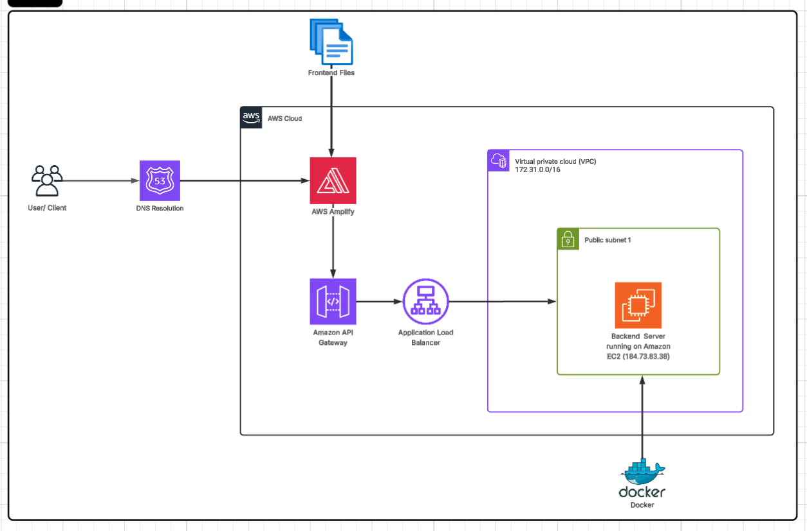

# ADIF Healthcare Dashboard

**Website Hosted At:** https://main.d2qt7sshytqqz1.amplifyapp.com/

A Complete Health Care Portal for Doctors and Patients to manage Doctors, view their availability, capabilities, patients information, stats on doctors and patients with filters to search doctors and patients, get an initial diagnosis on the doctor's report, Book a doctor's Appointment.

## What is this Project About

This project is a healthcare dashboard that provides:
- Patient data management and analytics
- Doctor profiles and appointment booking
- 3D human body visualization for educational purposes
- File upload system for patient reports
- Real-time data processing with interactive dashboards

## Deployment Architecture



### AWS Resources Used in Deployment

1. **Client/User**: End-users accessing the application through web browsers
2. **DNS Resolution**: AWS Route 53 for domain name resolution
3. **Frontend Files**: Static files hosted on AWS Amplify (CDN, S3, CI/CD)
4. **AWS Amplify**: Frontend hosting with automatic deployments and CDN distribution
5. **Amazon API Gateway**: RESTful API management and routing
6. **Application Load Balancer**: Traffic distribution and load balancing
7. **Virtual Private Cloud (VPC)**: Isolated network environment (172.31.0.0/16)
8. **Public Subnet**: Network subnet accessible from internet
9. **Amazon EC2**: Backend server hosting (184.73.83.38)
10. **Docker**: Containerized backend application deployment

### Architecture Flow
Client → DNS Resolution → AWS Amplify (Frontend) → API Gateway → Load Balancer → EC2 (Dockerized Backend)

## The Flow in the Website

### Main Dashboard
Users can upload doctor's reports to get suggestions on which diseases the person is suffering from, what conditions or allergies they might have, and which doctors to contact for these conditions.

### Doctors Section
Users can view doctors' information from each department, see stats of staff in each department, search doctors and find their availability times.

### Patients Section
Search functionality for finding patients, insights on patients in each department, and ability to click on a patient to view their reports.

### Book Appointment
Users can book appointments with any doctors provided they are available.

### 3D Visualization
Interactive 3D visualization of human body parts for educational purposes.

### Profile Section
In the navbar, users can access profile information where the currently logged-in user can view their information and modify it.

## Frontend Dashboard API Calls

### Main Dashboard
- `GET /health` - Health check for backend connectivity
- `GET /doctors` - Fetch doctors data for analytics
- `GET /patients` - Fetch patients data for analytics

### Doctors Dashboard
- `GET /doctors` - Fetch all doctors with filtering capabilities
- `GET /doctors/analytics` - Get pre-calculated analytics for charts
- `GET /doctors/summary` - Get summary statistics for doctors performance

### Patients Dashboard
- `GET /patients` - Fetch all patients with filtering and health metrics

### Patient Info Dashboard
- `POST /patient-info` - Process uploaded patient files and extract health data

### Appointment Booking
- `POST /book-appointment` - Book appointments with doctors

## Tech Stacks Used

### Frontend
- Next.js (React framework)
- TypeScript
- Three.js (3D graphics)
- React Three Fiber
- D3.js (charts and visualizations)
- React Hot Toast (notifications)

### Backend
- FastAPI (Python)
- Docker (containerization)
- JSON data storage

## Project Structure

The project is divided into two main parts:
- **Frontend**: Next.js application with React components and 3D visualization
- **Backend**: FastAPI Python service with Docker containerization

## Clone the Repository

```bash
git clone <repository-url>
cd ADIF-file-visualizer-assignment
```

## How to Run the Project

### Prerequisites
- Docker and Docker Compose
- Node.js 18+ and npm

### Backend Setup
See [Backend README](backend/README.md) for detailed setup instructions.

```bash
docker-compose up --build
```

### Frontend Setup

1. **Install dependencies and start**
   ```bash
   cd frontend
   npm install
   npm run dev
   ```

2. **Access the application**
   - Frontend: http://localhost:3000
   - Backend API: http://localhost:8080

## Testing

### Backend API Testing
Test the backend endpoints using curl or Postman:

```bash
# Health check
curl http://localhost:8080/health

# Get doctors data
curl http://localhost:8080/doctors

# Get patients data
curl http://localhost:8080/patients

# Get doctors analytics
curl http://localhost:8080/doctors/analytics

# Get doctors summary
curl http://localhost:8080/doctors/summary

# Upload patient file (replace with actual file path)
curl -X POST -F "file=@patient_report.pdf" http://localhost:8080/patient-info

# Book appointment (replace with actual JSON data)
curl -X POST -H "Content-Type: application/json" \
  -d '{"patient_id": "123", "doctor_id": "456", "date": "2024-01-15", "time": "10:00"}' \
  http://localhost:8080/book-appointment
```

### Frontend Testing
1. Open browser and navigate to http://localhost:3000
2. Test file upload functionality
3. Verify doctors and patients data display
4. Test 3D visualization features
5. Check appointment booking flow
6. Verify responsive design on different screen sizes
